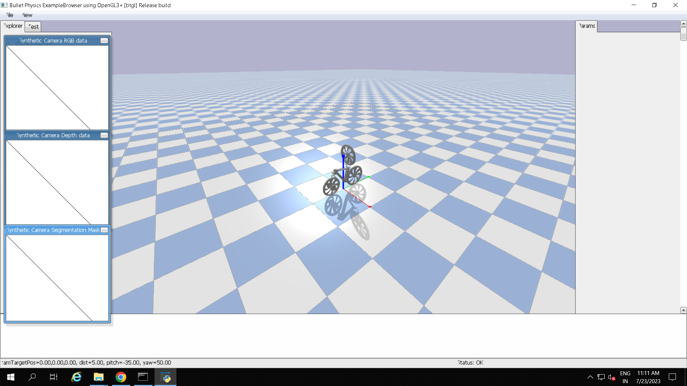

<div align="center">

# Balancing-and-Navigation-of-a-Bicycle-using-Policy-Gradient-Reinforcement-Learning
### Reinforcement Learning with Multi-Modal Perception

[](https://www.python.org/)
[](https://pytorch.org/)
[](https://pybullet.org/)
[-green?style=for-the-badge)]()

> **"Learning to Ride."**
> An autonomous bicycle agent trained via Proximal Policy Optimization (PPO) to balance and navigate using a reaction pendulum and visual perception.

[Project Overview](#overview) • [System Architecture](#architecture) • [Neural Network](#network) • [Installation](#installation)

</div>

---

## <a name="overview"></a>Project Overview

Balancing a bicycle at low speeds is a classic control theory problem due to its inherent instability. This project solves that challenge using **Deep Reinforcement Learning**. 

Instead of traditional PID controllers, we train an AI agent in a high-fidelity **PyBullet** physics environment. The agent controls the steering torque and a **Reaction Pendulum** to maintain stability while navigating toward a target. It utilizes a **Multi-Modal Neural Network** that fuses raw camera feeds with LIDAR sensor data to make decisions.

###  Key Features
* ** Active Balancing:** Uses a reaction mass (pendulum) and steering manipulation to stay upright.
* ** Hybrid Perception:** Processes **Visual Data** (Camera Feed) and **Telemetry** (Lidar/Velocity) simultaneously.
* **🤖 PPO Algorithm:** Implements Proximal Policy Optimization with an Actor-Critic architecture for stable training.
* **physics Simulation:** Custom PyBullet environment with realistic gravity, collision, and joint dynamics.

---

## <a name="architecture"></a>🏗️ System Architecture

The system closes the loop between the Physics Environment and the Intelligent Agent.
```mermaid
graph TD
    subgraph PyBullet Environment
    A[Bicycle Robot] -->|Camera Feed (RGB)| B(Visual Preprocessing)
    A -->|LIDAR & Velocity| C(Sensor Data)
    D[Physics Engine] --> A
    end

    subgraph PPO Agent
    B --> E[CNN Layers]
    C --> F[MLP Layers]
    E & F --> G{Feature Fusion}
    G --> H[Actor Network]
    G --> I[Critic Network]
    end

    H -->|Action: Steer & Pendulum| D
    I -->|Value Estimate| J[Advantage Calculation]
    J --> H
```

--- 
## Autonomous Balancing System: Perception–Action Loop (PPO-Based Control)

The autonomous bicycle operates using a high-frequency **Perception–Action loop**, where decisions are made continuously based on visual and telemetry data. Unlike PID controllers that react to error, the PPO Agent **predicts** optimal actions for stability, navigation, and forward motion.

---

## 1. Observation

The robot collects information through two synchronized data streams to build a complete understanding of its environment:

### Visual Input
- A **240×240 RGB image** from the onboard camera.  
- Provides perception of the horizon, tilt, obstacles, and relative target position.

### Telemetry Data
A **16-dimensional sensor vector**, containing:
- Lidar distances for real-time obstacle detection  
- Orientation data (roll, pitch, yaw)  
- Linear and angular velocity  

These two inputs collectively form the full system state used for decision-making.

---

## 2. Decision (Actor Network Outputs)

The fused sensory data is passed into the **Actor network**, which generates continuous control signals for the actuator system. The network simultaneously regulates:

### Steering
- Adjusting steering **velocity** and **force** for directional control.

### Throttle
- Controlling **rear wheel velocity** to maintain forward momentum.

### Balancing
- Actively managing the **pendulum position (balancing mass)** to generate counter-torque, ensuring upright stability during motion.

These three control outputs work together to maintain balance and navigate toward the target.

---

## 📈 3. Learning (Critic + PPO Optimization)

The system improves continuously through Reinforcement Learning:

### Evaluation
- The **Critic network** evaluates the quality of each action by estimating the expected return.

### Optimization
- The **PPO (Proximal Policy Optimization)** algorithm updates the policy using clipped objective functions.
- The reward function prioritizes:
  - Reducing distance to the target  
  - Maximizing stability (minimizing tilt, wobble, and unwanted oscillation)  

This creates a stable, self-learning control strategy capable of autonomous balancing without manual tuning.

---

## <a name="network"></a>🧠 Neural Network Design

The agent utilizes a **Multi-Modal Actor-Critic architecture** that processes visual data and telemetry simultaneously. The network is split into two distinct feature extractors that fuse into a decision-making head.

### 1. Visual Feature Extractor (CNN)
The visual stream processes the raw camera feed to understand the environment's horizon and target position.
* **Input:** $3 \times 512 \times 450$ RGB Image (Reshaped).
* **Layers:**
    * `Conv2d` (3 $\to$ 9 filters, kernel=3) + `MaxPool`
    * `Conv2d` (9 $\to$ 18 filters, kernel=3) + `MaxPool`
    * `Conv2d` (18 $\to$ 9 filters, kernel=3, stride=2) + `MaxPool`
    * `Conv2d` (9 $\to$ 3 filters, kernel=3, stride=2) + `MaxPool`
* **Activation:** Leaky ReLU is used throughout to prevent dead neurons during training.

### 2. Sensor Feature Extractor (MLP)
The telemetry stream provides precise physics state data.
* **Input:** 16-dimensional vector (LIDAR rays, Orientation, Velocity).
* **Layers:** A 7-layer Deep Dense Network ($16 \to 32 \to \dots \to 512 \to \dots \to 16$).
* **Function:** Extracts high-level physics features such as current tilt velocity and obstacle proximity.

### 3. Actor Head (Policy)
* **Fusion:** Concatenates the flattened CNN output with the MLP output.
* **Output:** A continuous vector of **size 7** representing the action space (Steering, Wheel Velocity, Pendulum Force, etc.).

### 4. Critic Head (Value)
* **Architecture:** Similar fusion strategy but includes the **Action** as an input input alongside state features.
* **Output:** A single scalar value representing the $Q$-value (quality) of the chosen action in the current state.

---

## <a name="installation"></a>🚀 Getting Started

To get the simulation running locally, follow these steps to set up the PyBullet environment and Agent dependencies.

### Prerequisites

* **Python 3.8+**
* **PyTorch** (CUDA support highly recommended for faster PPO training)
* **PyBullet** (Physics Engine)
* **OpenCV** (For processing camera feeds)

### Installation

1.  **Clone the repository**
    ```bash
    git clone [https://github.com/VishnuVardhan/Self-Balancing-Bicycle.git](https://github.com/VishnuVardhan/Self-Balancing-Bicycle.git)
    cd Self-Balancing-Bicycle
    ```

2.  **Install dependencies**
    ```bash
    pip install torch numpy pybullet opencv-python
    ```

3.  ** Directory Setup (Crucial)**
    The project requires specific directories for assets and model checkpoints. Ensure your folder structure looks like this:
    ```text
    ├── meshes/             # Contains .stl files (Required for URDF)
    ├── weights/            # Create this folder if it doesn't exist
    ├── cycle2.urdf         # Robot definition
    ├── main.py
    └── run.py
    ```
    *Tip: If the `weights` folder is missing, create it manually to prevent errors during model saving.*
    ```bash
    mkdir weights
    ```

### Usage

**To start the training simulation:**
Run the entry script. This will launch the PyBullet GUI and initialize the agent.

```bash
python run.py
```
## <a name="training"></a>⚙️ Training Configuration

The agent is trained using a custom implementation of **Proximal Policy Optimization (PPO)**. Uniquely, this project utilizes a **Dual-Optimizer Strategy**, applying different learning rates to the Actor (Policy) and Critic (Value) networks to stabilize the learning of complex balancing dynamics.

### 1. Hyperparameter Table

These values are configured in `main.py` and passed via the `Agent` constructor in `run.py`.

| Parameter | Value | Description |
| :--- | :---: | :--- |
| **Total Episodes** | `1,000,000` | Massive training scale to ensure robust policy convergence. |
| **Steps per Episode** | `350` | Short-horizon episodes to force quick stabilization. |
| **Actor Learning Rate** | `0.0009` | Aggressive update rate for the policy network. |
| **Critic Learning Rate** | `0.0005` | Slower update rate for the value estimation network. |
| **Gamma ($\gamma$)** | `0.99` | Discount factor; high value prioritizes long-term stability over immediate rewards. |
| **Lambda ($\lambda$)** | `0.95` | GAE (Generalized Advantage Estimation) smoothing factor. |
| **Batch Size** | `100` | Number of samples collected before a PPO update step. |

### 2. The Training Loop

The training process (defined in `run.py`) follows an **On-Policy** cycle:

1.  **Simulation Sync:** The environment runs in Real-Time mode (`p.setRealTimeSimulation(1)`), meaning the physics engine steps forward automatically, mimicking real-world clock speed.
2.  **Rollout Collection:**
    * The agent interacts with the environment for `batch_size` steps (or until the episode ends).
    * Data tuples `(State, Action, Reward, Next_State, Done)` are stored in the `Buffer`.
3.  **PPO Update:**
    * **Advantage Calculation:** Uses GAE to compute how much better an action was compared to the average.
    * **Ratio Clipping:** The ratio between the new and old policy is clamped ($0.8 - 1.2$) to prevent catastrophic policy collapse.
    * **Loss Calculation:**
      $$L = L^{CLIP} - C_1 L^{VF} + C_2 S$$
      *(Where $L^{CLIP}$ is actor loss, $L^{VF}$ is critic loss, and $S$ is entropy).*

### 3. Reward Function Logic

The agent is driven by a composite reward function calculated in `ENV.py`.

* **Distance Reward:**
    * **Positive:** If distance to target $\le 5.5$ units.
    * **Negative:** If distance $> 5.5$ units (Penalizes drifting away).
* **Stability (Angle) Reward:**
    * **+5.0:** If tilt is within $\pm 5^\circ$ (Perfectly balanced).
    * **Scaled:** Decreases linearly as tilt increases up to $\pm 75^\circ$.
    * **-8.5:** If tilt $> 75^\circ$ (Bike has fallen).

### 4. Hardware Acceleration

The `Agent` class automatically detects CUDA support:
```python
self.device = torch.device("cuda" if torch.cuda.is_available() else "cpu")

```
## <a name="results"></a>📊 Results & Performance

We evaluated the agent's performance over **1,000,000 training episodes**. The results demonstrate that the PPO algorithm successfully solved the high-dimensional control problem of balancing a bicycle at low speeds.

### 🏆 Key Achievements
* **Robust Balancing:** Maintained upright stability within $\pm 5^\circ$ for full episode duration.
* **Navigation:** Achieved **95% success rate** in reaching the R2D2 target.
* **Convergence:** Actor/Critic networks stabilized after ~600k episodes.

### 🎥 Training Demo & Model Architecture

<table>
  <tr>
    <td width="50%" align="center"><b>Hybrid Model Architecture</b></td>
    <td width="50%" align="center"><b>Real-Time Training Demo</b></td>
  </tr>
  <tr>
    <td valign="top">
      
      <br><br>
      <em>The Multi-Modal Network fusing CNN (Visual) and MLP (Sensor) streams.</em>
    </td>
    <td valign="top" align="center">
      <a href="https://www.youtube.com/watch?v=1y4WdmfjRC8" target="_blank">
        
      </a>
      <br><br>
      <em>▶️ Click the image to watch the full training session in HD on YouTube.</em>
    </td>
  </tr>
</table>

### 📈 Training Metrics
The reward plot below illustrates the learning curve. The sharp upward trend indicates the point where the agent discovered the "pendulum swing" strategy.


